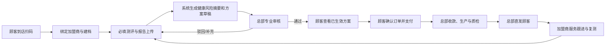

# LAVIDA 目标产品功能规格说明书

> 版本：V1.0（开发基线）  
> 范围：顾客微信小程序、加盟商工作台、总部运营后台  
> 依据：已确认业务流程、问卷截图、演示后台的方案列表/详细配方/SKU 台账。  
> 医疗边界：本系统输出为健康管理建议与商品组合建议，不作疾病诊断、处方或替代就医建议；涉及药物、营养成分、禁忌、剂量和宣称的最终内容，必须由具备相应资质的专业审核人确认后才可对顾客生效。

## 1. 目标业务闭环与角色权限

| 角色 | 可执行动作 | 不可执行动作 |
|---|---|---|
| 顾客 | 建档授权、完成测评、上传报告、查看已生效方案、下单支付、查看履约、申请售后、复测 | 查看草稿/被拒方案、修改审核通过方案、查看他人信息 |
| 加盟商店员/顾问 | 发起服务码、维护顾客服务记录、查看已生效方案、协助解释、跟进复测、查看归属订单和佣金 | 创建/修改/审核方案、查看非归属顾客、变更支付金额或生产状态 |
| 总部审核人 | 查看资料、调整受控方案参数、审核通过/驳回、留下审核意见 | 绕过禁忌/库存/配方校验强制通过 |
| 总部运营/财务/生产/履约 | 各自领域的订单、库存、生产、发货、结算、经营管理 | 跨角色越权导出或修改健康数据 |
| 平台管理员 | 租户、组织、角色、字典、审计与接口配置 | 修改业务留痕、删除已发生交易/审核记录 |

### 1.1 全局状态机

| 对象 | 状态 | 转换规则 |
|---|---|---|
| 测评 | 草稿、待补报告、待生成、生成中、待审核、已生效、已驳回、已失效 | 全部必答题完成且报告校验通过才可提交；生成后不可改原始答案；审核通过生成已生效快照。 |
| 方案 | 草稿、待审核、审核通过、审核驳回、已失效、已替代 | 只有“审核通过”可下单；任何受控参数修改均生成新版本并重新审核。 |
| 订单 | 待支付、支付中、已支付、待生产、生产中、待质检、待发货、运输中、已签收、已完成、售后中、已关闭 | 支付回调幂等；已支付才可创建生产任务；签收后进入服务跟进。 |
| SKU | 草稿、启用、停用、归档 | 停用 SKU 不可进入新配方；历史配方保留 SKU 快照。 |

### 1.2 全局开发规则

1. 所有核心对象使用不可变业务编号：测评 `ASM-YYYYMMDD-序号`、方案 `PLAN-YYYYMMDD-序号`、订单 `ORD-YYYYMMDD-序号`、生产批次 `BATCH-YYYYMMDD-序号`。
2. 顾客、健康信息、检查报告均为敏感个人信息：首次提交前展示单独授权；最小权限、传输加密、对象存储私有读、下载水印、访问/下载审计。
3. 所有保存、提交、审核、支付回调、配方变更、库存扣减、发货和签收写入操作日志，字段至少含操作者、角色、时间、前后值、来源端、IP/设备标识、关联编号。
4. 金额以分存储；百分比保留 2 位；重量/剂量以“数值 + 单位”存储；所有时间存 UTC，前端按中国时区展示。
5. 所有列表提供：关键字、状态、创建/更新时间范围、分页、空状态、加载态、无权限态；导出必须异步任务、权限控制和水印。

## 2. 三级功能架构

| 产品端 | 一级模块 | 二级模块 | 三级功能点 |
|---|---|---|---|
| 顾客小程序 | 到店建档 | 扫码服务 | 解析服务码、门店绑定、失效码提示 |
| 顾客小程序 | 到店建档 | 顾客档案 | 手机号授权、基础资料、隐私同意、档案编辑 |
| 顾客小程序 | 智能测评 | 问卷填写 | 维度卡片、单选、多选、进度、暂存、必填校验 |
| 顾客小程序 | 智能测评 | 检查报告 | Word/PDF 上传、文件校验、结构化摘要、删除重传 |
| 顾客小程序 | 智能测评 | 提交与结果 | 提交确认、生成进度、风险摘要、补充资料 |
| 顾客小程序 | 方案中心 | 方案查看 | 审核状态、方案摘要、配方/商品、使用建议、版本 |
| 顾客小程序 | 订单中心 | 交易 | 确认订单、地址、优惠/金额、支付、支付结果 |
| 顾客小程序 | 订单中心 | 履约与售后 | 订单列表、生产进度、物流、签收、售后申请 |
| 顾客小程序 | 服务追踪 | 随访复测 | 服务提醒、复测入口、历史对比 |
| 顾客小程序 | 我的 | 账户与消息 | 个人资料、消息、隐私授权、设置 |
| 加盟商工作台 | 门店工作台 | 经营概览 | 待服务、待支付、复测、业绩与佣金 |
| 加盟商工作台 | 顾客服务 | 顾客管理 | 顾客列表、详情、服务码、随访、复测提醒 |
| 加盟商工作台 | 方案服务 | 方案解读 | 已生效方案只读、解释记录、转订单提示 |
| 加盟商工作台 | 订单服务 | 订单跟踪 | 顾客订单、履约状态、售后协办 |
| 加盟商工作台 | 财务 | 佣金 | 佣金明细、结算单、异议提交 |
| 总部后台 | 客户与测评 | 顾客/测评 | 客户档案、测评记录、报告预览、题库与规则 |
| 总部后台 | 方案中心 | 方案审核 | 方案列表、详情、审核、配方、版本、再生成 |
| 总部后台 | 商品与供应链 | SKU 主数据 | SKU 台账、分类规格、供应商、配方映射 |
| 总部后台 | 商品与供应链 | 库存采购 | 库存、变动、预警、采购建议/采购单 |
| 总部后台 | 订单财务 | 订单/支付 | 主子单、金额核验、退款/售后、发票 |
| 总部后台 | 生产履约 | 生产/质检/物流 | 排产、任务、批次、质检、发货、签收 |
| 总部后台 | 加盟商经营 | 加盟商管理 | 加盟商、门店、人员、合同、佣金与结算 |
| 总部后台 | 运营与平台 | 分析与治理 | 看板、消息、接口、组织权限、字典、审计 |

## 3. 顾客小程序页面与交互规格

### 3.1 P-C01 扫码建档页

**功能介绍**：顾客在加盟商店内扫描服务二维码，建立“顾客—门店—加盟商—服务场景”的可追溯归属。

| 区域/字段 | 类型与要求 | 开发逻辑与交互 |
|---|---|---|
| 服务码 `serviceToken` | URL 参数；必填；JWT/随机码；有效期建议 24 小时 | 进入页立即校验签名、状态、有效期、门店启用状态；不展示原始 token。 |
| 门店名称/地址 | 只读文本 | 校验通过展示；顾客确认后才绑定。 |
| 服务项目 | 只读标签 | 取服务码配置，如“健康测评 + 报告上传”。 |
| 手机号授权 | 微信手机号能力；必填 | 未登录时点击“授权并继续”；后端以 unionid/openid + 手机号去重。 |
| 隐私政策勾选 | checkbox；必勾 | 未勾选禁用“开始建档”；链接打开政策页。 |
| `开始测评` | 主按钮 | 创建或恢复本次服务会话；同一服务码重复进入需命中未完成测评草稿。 |

**弹窗**：服务码无效（原因：过期/停用/非本门店）；已绑定其他门店（显示最近服务门店与“继续当前服务/取消”）；隐私授权说明（授权项、用途、保存期限、撤回方式）。

### 3.2 P-C02 基础档案页

| 字段 | 规则 |
|---|---|
| 姓名 | 必填；2–30 字；支持中文/字母/中点；默认微信昵称不可直接替代实名。 |
| 性别 | 必填；女/男/其他/不愿透露；影响规则时需说明用途。 |
| 出生日期 | 必填；日期选择；年龄范围 18–80（超出提示人工服务）。 |
| 身高 cm、体重 kg | 必填；身高 100–250、体重 25–300；自动计算 BMI，仅作健康管理展示。 |
| 常住地区 | 必填；省/市/区三级；收货地址可后补。 |
| 既往重要健康情况 | 必填单选：无/有/不确定；选择“有”时显示文本说明，2–500 字。 |
| 过敏/不耐受情况 | 必填单选：无/有/不确定；选择“有”时显示过敏原文本，2–300 字。 |
| 妊娠/哺乳状态 | 必填单选：否/是/不适用；“是”直接加高风险标记并提示专业咨询。 |
| 免责声明 | 必勾；展示非诊疗、异常应就医、数据处理说明。 |

交互：页面底部固定“保存并进入测评”；输入离焦实时校验，首次点击时聚焦第一个错误字段；保存成功后显示“已保存”轻提示。

### 3.3 P-C03 问卷填写页（截图落地规范）

**页面结构**：顶部返回、标题“问卷填写”；白色圆角进度卡（`已完成 X/Y 题`、进度条）；一个或多个维度卡片；底部固定“暂存”“保存问卷并继续上传”。

| 控件/字段 | 要求 |
|---|---|
| 维度标题与说明 | 必显；例如“基础状态——用于了解当前精力、睡眠和疲劳情况”。 |
| 题干 `questionText` | 必显；最多 60 字；必答角标“必填”。 |
| 题型 `single` | 单选胶囊按钮；点击后立即高亮并写草稿；不可取消为无选状态，只能改选。 |
| 题型 `multiple` | 多选胶囊按钮；题干下显示“可多选”；至少 1 项；最多选数按题库配置。 |
| 题型 `scale` | 1–5 分五档；每档有文字锚点；不可只保存半选择。 |
| 题型 `boolean` | 是/否；必选。 |
| 题型 `text` | 仅在题库启用时使用；必填时去首尾空格后 2–300 字。 |
| 暂存 | 总是可点；保存当前答题和进度，不触发生成；显示“已暂存于 HH:mm”。 |
| 保存并继续上传 | 仅所有必答题完成才可点；否则显示“请完成第 X 题”，滚动并高亮错误题。 |

**默认健康管理维度与题库**（总部可配置版本；所有题均必填）：

| 维度 | 题目/类型 | 默认选项与评分（仅健康风险筛查，不诊断） |
|---|---|---|
| 基础状态 | 近两周睡眠质量如何？/单选 | 很好 0；一般、偶尔失眠或早醒 1；较差、经常难以入睡或夜醒 2。 |
| 基础状态 | 最近最明显的身体感受是？/多选 | 易疲劳、睡眠浅、精力不足、皮肤状态下滑，各 1；可增“无明显不适”0，选它时互斥其他项。 |
| 生活方式 | 每周运动频率？/单选 | 每周 3 次及以上 0；每周 1–2 次 1；基本不运动 2。 |
| 生活方式 | 蔬果/高油高糖摄入情况？/单选 | 均衡 0；偶有不规律 1；长期不规律 2。 |
| 压力情绪 | 近两周压力感受？/单选 | 轻度 0；中等 1；明显且影响生活 2。 |
| 皮肤与外观 | 当前主要诉求？/多选 | 抗氧化、皮肤状态、精力管理、睡眠支持、体重管理；为偏好标签，不直接累加风险。 |
| 健康安全 | 是否存在医生要求持续管理的疾病/正在使用药物？/单选+条件文本 | 否 0；是/不确定=高风险人工审核标记，展示说明文本必填 2–500 字。 |
| 健康安全 | 是否有产品成分过敏或不耐受？/单选+条件文本 | 否 0；是/不确定=人工审核标记，过敏原文本必填。 |

**评分与判定**：每维度得分 `dimensionScore = min(100, round(选项权重之和 / 该维度最大权重 * 100))`。总分仅作为“需关注程度”，不得展示为疾病评分：0–29 常规关注、30–59 建议改善、60–100 需专业复核。任一安全题选“是/不确定”、妊娠/哺乳、或报告命中红旗关键词时，`manualReviewRequired=true`，覆盖总分判定。题库、权重、文案、规则版本必须随测评快照保存。

### 3.4 P-C04 检查报告上传页

| 字段/控件 | 规则与交互 |
|---|---|
| 报告类型 | 必选：体检报告/化验单/影像结论/其他；选择“其他”需填写说明 2–100 字。 |
| 报告日期 | 必填；不能晚于今天；建议不早于 24 个月，超期仅提示不阻断。 |
| 报告文件 | 至少 1 个；仅 `.pdf`、`.doc`、`.docx`；单文件 ≤20MB、最多 5 个；文件名 1–100 字。 |
| 上传状态 | 上传中显示百分比且可取消；完成显示文件名、大小、类型、预览/删除。 |
| 解析状态 | 后台异步：待解析/解析中/可用/需人工确认/失败；失败展示原因与重新上传。 |
| 结构化摘要 | 解析成功后展示仅供确认的项目名、结果、单位、参考范围、异常标志；顾客可“标记解析有误”，不能直接改原始报告。 |
| `提交测评` | 所有问卷完成、至少一份文件已上传且服务授权有效时可点；弹窗二次确认“提交后不可修改原始答案”。 |

文件安全：服务端 MIME + 魔数双校验、病毒扫描、PDF/Office 安全解析、私有对象存储、短时签名预览链接；禁止将 Word/PDF 的宏或外链内容在前端执行。

### 3.5 P-C05 提交成功与生成进度页

字段：测评编号、提交时间、门店名称、状态时间轴（资料校验/智能分析/专业审核/方案生效）、预计完成说明、`查看进度`、`返回首页`。  
逻辑：轮询 15 秒或 WebSocket 收取状态；超过配置 SLA 显示“资料正在由专业人员复核”；驳回状态仅展示“需补充资料”和补充入口，不展示未审核的配方。

### 3.6 P-C06 方案中心、方案详情页

| 区域 | 字段与规则 |
|---|---|
| 状态卡 | 方案编号、状态、审核完成时间、有效期、版本号；待审核仅显示进度，不显示商品/配方。 |
| 健康摘要 | 各维度标签、需关注项、生活方式建议、就医提醒；禁止诊断性病名和绝对疗效表述。 |
| 方案目标 | 1–3 项目标、建议周期、复测建议日期；审核人发布后固定为版本快照。 |
| 商品组合 | SKU 名称、规格、数量、建议用法、单价、总价；只展示已上架/可售 SKU。 |
| 配方明细（受控展示） | SKU 编码、SKU 名称、占比%、建议用量、适用原因、机器参数、有效性校验、库存校验；顾客端可按合规策略隐藏机器参数。 |
| 安全说明 | 适用/不适用人群、过敏提示、与现用药物需咨询专业人士提示、非诊疗声明；必显。 |
| 版本记录 | 版本号、状态、生成时间、审核时间、变更摘要；只读。 |
| `确认方案并下单` | 仅方案已审核通过、未过期、SKU 可售且库存可承诺时可点；否则展示精确原因及联系入口。 |

弹窗：方案免责声明确认（必勾“我已阅读”）；方案失效（显示原因、新测评/联系门店按钮）；库存变化（价格、商品、库存变化前后对比，需重新确认）。

### 3.7 P-C07 确认订单、支付、支付结果页

| 页面 | 字段与要求 | 逻辑/交互 |
|---|---|---|
| 确认订单 | 方案编号只读、商品清单、数量只读或按配置可调、收货人、手机号、地区、详细地址、配送方式、商品金额、运费、优惠、应付金额、协议勾选 | 地址字段全部必填：收货人 2–30 字，手机号 11 位，详细地址 5–100 字；创建订单前重新锁定价格和库存。 |
| 提交订单弹窗 | 订单金额、支付倒计时、协议 | 点击“确认并支付”创建待支付订单，生成幂等键；连续点击只创建一单。 |
| 支付页 | 订单号、应付金额、支付方式、倒计时、支付按钮 | 调用微信支付预下单；支付结果只以服务端支付回调为准；前端主动查询作兜底。 |
| 支付结果 | 成功/处理中/失败、订单号、支付金额、查看订单/返回首页 | “处理中”每 5 秒查询，最多 3 分钟后引导联系客服；禁止仅以前端回调判定成功。 |

### 3.8 P-C08 订单、履约、售后页

订单列表筛选：全部、待支付、待生产、生产中、待发货、运输中、已完成、售后；每卡显示订单号、商品摘要、金额、状态、下单时间、主操作。  
订单详情字段：订单状态时间轴、方案快照编号、商品 SKU 快照（编码/名称/规格/数量/成交价）、收货信息脱敏展示、金额明细、支付流水号脱敏、生产批次、质检结论、物流公司/运单号/轨迹、售后记录。

售后申请弹窗字段：订单/商品只读、售后类型（退款/破损/漏发/其他）、原因（必选）、说明（必填 5–500 字）、图片（0–6 张，jpg/png，单张 ≤10MB）、联系电话（默认档案手机号，可改）；提交后状态为“待审核”。

### 3.9 P-C09 服务追踪、复测与我的

| 页面 | 字段/操作 |
|---|---|
| 服务追踪 | 用法提醒开关、每日提醒时间、完成打卡、异常反馈（不适类型/说明/图片）、复测建议日期、立即复测。 |
| 历史测评 | 测评编号、日期、状态、风险维度摘要、报告数量、查看详情；不允许修改历史原始答案。 |
| 历史方案 | 方案编号、版本、审核状态、有效期、关联订单、查看。 |
| 个人资料 | 姓名、性别、出生日期、手机号、地区、过敏/不耐受、健康资料授权状态；修改敏感字段需二次确认并记录。 |
| 消息中心 | 未读数、类型（审核/订单/物流/服务/系统）、标题、摘要、时间、已读状态、详情；支持单条/全部已读。 |
| 设置 | 隐私政策、授权管理、消息通知、账号注销申请、关于我们；撤回授权后停止新处理并按法规/合同保留必要交易记录。 |

## 4. 加盟商工作台页面与交互规格

### 4.1 P-F01 门店工作台

卡片：今日到店、待完成测评、待审核方案、待支付订单、待复测顾客、本月 GMV、预计佣金；每张卡可跳转对应列表。图表按日显示到店/成交趋势，默认近 7 天，支持近 7/30/自定义日期。数据仅限当前加盟商及获授权门店。

### 4.2 P-F02 顾客列表、详情、服务码

| 页面 | 字段/交互 |
|---|---|
| 顾客列表 | 筛选：姓名/手机号后四位、服务状态、最近到店、负责人；列：顾客姓名、性别年龄、手机号脱敏、最近测评、方案状态、订单状态、负责人、最近跟进、操作。 |
| 顾客详情 | 基础资料、服务时间线、测评只读摘要、已生效方案、订单、物流、随访记录、复测计划；敏感报告默认不可下载。 |
| 创建服务码弹窗 | 服务项目、适用门店、有效期、顾客手机号（可空）、顾问、备注；有效期 1 小时–7 天；生成二维码/小程序码并支持复制链接。 |
| 随访记录弹窗 | 联系时间、方式（到店/电话/微信/其他）、服务结果（已联系/未接/需跟进）、顾客反馈 2–1000 字、下次跟进日期、附件 0–3 个；保存即写时间线。 |

### 4.3 P-F03 已生效方案解读与订单协办

页面字段：方案编号、审核状态、风险摘要、目标、商品组合、建议周期、安全说明、关联订单；仅“已审核通过”可展示完整内容。  
操作：`记录解读`（解读时间、顾客是否知悉、疑问分类、备注、下次跟进）；`提醒顾客下单`（仅发送站内/订阅消息，需顾客已同意通知）；`查看订单`。严禁“编辑方案”“提交审核”“创建配方”等入口。

### 4.4 P-F04 订单、佣金与门店设置

| 页面 | 字段/规则 |
|---|---|
| 订单列表 | 订单号、顾客、方案、金额、支付状态、生产/物流状态、售后状态、下单时间；只读，售后可协办。 |
| 佣金明细 | 订单号、顾客脱敏、成交金额、佣金规则版本、佣金率、预计/已结算佣金、结算状态、结算周期、异常原因。 |
| 结算单详情 | 结算单号、周期、订单数、应结/扣减/实结、收款账户尾号、状态、总部审核意见、附件；可提交异议（原因 5–500 字+附件）。 |
| 门店资料 | 门店名称、地址、营业时间、负责人、服务电话、门店图片、状态；总部审批字段只读，修改提交后待总部确认。 |

## 5. 总部后台页面与交互规格

### 5.1 P-H01 总部工作台

指标：今日新增测评、待审核方案、待财务处理订单、待生产任务、低库存 SKU、风险预警；待办清单按角色展示并可跳转。  
风险预警字段：预警类型、等级、关联对象、触发规则、发生时间、负责人、状态、处置入口；关闭预警必须填写处置说明 2–500 字。

### 5.2 P-H02 顾客与测评管理

| 页面/弹窗 | 字段与要求 |
|---|---|
| 顾客列表 | 筛选：姓名、手机号、加盟商、门店、建档时间、服务状态；列：顾客编号、姓名、年龄/性别、归属门店、最新测评、方案状态、订单状态、创建时间。 |
| 顾客详情 | 基础档案、授权记录、测评时间线、报告文件、方案版本、订单、随访、审计日志；下载/预览须权限校验及水印。 |
| 测评列表 | 测评编号、顾客、门店、题库版本、提交时间、风险等级、报告解析状态、方案状态、操作。 |
| 测评详情 | 维度分数、题目/选项快照、风险命中规则、报告结构化摘要、人工标记、生成日志；原始答案不可直接编辑。 |
| 题库管理 | 列：题库版本、维度、题目、题型、必填、选项数、状态、更新时间；操作：新建/复制版本/停用/发布。 |
| 题目编辑弹窗 | 维度、题干、说明、题型、是否必填（固定为是）、选项（文本、分值、风险标签、互斥项）、最大选择数、排序、适用人群、状态；题干 2–100 字、选项 2–60 字，单选至少 2 项、多选至少 2 项；已发布题目只能复制后修改。 |
| 规则编辑弹窗 | 规则名称、题库版本、触发条件、分值/等级、人工复核标记、提示文案、启停、优先级；需提供模拟样本校验，发布需双人复核。 |

### 5.3 P-H03 方案中心

#### 5.3.1 方案列表与详情

列表筛选：顾客姓名、生成时间范围、状态（待审核/已审核/已拒绝/已失效）、模型版本、加盟商；列严格参照演示：**方案编号、客户姓名、生成时间、模型版本、状态、成分数量、操作**。操作：详情、审核、配方、版本、重新生成；已审核方案不显示“审核”操作。

详情页字段：方案编号、客户、关联测评编号、题库/规则/模型版本、生成时间、风险摘要、方案目标、建议周期、方案说明、审核状态、审核意见、审核人、审核时间、有效期、关联订单、版本时间线。

#### 5.3.2 配方页（参照演示字段）

配方页顶部：方案编号、顾客、配方版本（如 `FV-YYYYMMDD-X`）、进入审核/创建订单（按权限和状态控制）。

| 表字段 | 要求 |
|---|---|
| SKU 编码 | 必填；引用启用 SKU；配方版本冻结编码。 |
| SKU 名称 | 自动带出，只读。 |
| 占比 % | 必填；0.01–100.00；全部明细合计必须等于 100.00%，允许 ±0.01 的浮点校正。 |
| 建议用量 | 必填；正数；单位来自 SKU/配方单位字典。 |
| 适用原因 | 必填；5–300 字；只允许经合规词库审核的健康管理描述。 |
| 机器参数 | 必填；键值对，如温度、转速、时长、装量；参数名/范围受 SKU 工艺模板校验。 |
| 校验 | 系统只读：SKU 有效性、库存可用性、禁忌冲突、配方比例、工艺参数、价格可用性。 |

#### 5.3.3 审核与版本弹窗

| 弹窗 | 字段、校验和交互 |
|---|---|
| 审核方案 | 方案摘要只读、风险命中只读、报告预览、审核结论（通过/驳回/退回补充，必选）、审核意见（通过可选 0–500；非通过必填 5–500）、有效期（通过必填，1–365 天）、审核人电子签名/二次口令；提交前强制通过所有配方校验。 |
| 调整配方 | 明细表（同配方字段）、调整原因（必填 5–300）、影响提示、版本备注；新增/删除 SKU、改比例/用量/工艺均触发新版本和重新审核。 |
| 重新生成 | 生成原因（必选：资料补充/规则升级/审核驳回/其他）、其他说明、是否保留原配方；生成后旧稿只读。 |
| 版本对比 | 左右版本选择、字段差异（风险、目标、SKU、比例、用量、价格、审核意见）、变更人、时间、变更原因；只读。 |

### 5.4 P-H04 SKU 主数据与配方映射

#### 5.4.1 SKU 台账（参照演示）

筛选：关键字（SKU 编码/名称）、分类、供应商、状态。列表字段：**SKU 编码、名称、分类、规格、单位、单价、当前库存、供应商、状态、操作**。支持新增 SKU、批量导入、编辑、停用/启用、删除（仅草稿且无业务引用）。

| 新增/编辑 SKU 弹窗字段 | 校验 |
|---|---|
| SKU 编码 | 必填；3–50 位大写字母/数字/连字符；全局唯一；编辑后不可改。 |
| SKU 名称 | 必填；2–100 字；同一分类下不可重复。 |
| 分类 | 必填；引用启用分类；如抗衰核心、抗氧化支持、睡眠修复。 |
| 供应商 | 必填；引用有效供应商。 |
| 规格 | 必填；2–60 字；示例“60 粒/瓶”。 |
| 单位类型 | 必填；瓶/盒/袋/克/毫升/其他字典项。 |
| 单价 | 必填；0.01–999999.99；含税口径由价格类型字段标识。 |
| 当前库存 | 必填；非负整数；新增可录期初库存，编辑不允许直接改，改库存须走库存变动单。 |
| 状态 | 必填开关；启用前必须有完整工艺、禁忌、供应商和价格资料。 |
| 成分/含量 | 必填；成分名称、每单位含量、单位；支持多行。 |
| 禁忌与适用限制 | 必填；人群/过敏原/合用注意事项；可选择字典+说明。 |
| 工艺参数模板 | 必填；温度、转速、时长、装量等字段名、单位、最小/最大值、默认值。 |

分类规格页字段：分类编码、分类名称、父分类、配方适用标签、状态、排序。供应商页字段：供应商编码、名称、统一社会信用代码、联系人、联系电话、地址、资质文件、状态、合作起止日期。配方映射页字段：健康目标/风险标签、候选 SKU、优先级、最小/最大占比、默认用量、禁忌规则、规则版本、状态。

### 5.5 P-H05 库存采购

| 页面 | 字段与交互 |
|---|---|
| 库存总览 | SKU、仓库、可用库存、锁定库存、在途库存、安全库存、近效期数量、库存状态；点击进入批次明细。 |
| 库存变动单 | 变动单号、类型（入库/出库/冻结/解冻/盘点/报损）、SKU、批次、数量、前后库存、关联单据、原因、经办人、时间；已生效单据不可编辑。 |
| 预警中心 | 缺货/低库存/近效期/配方不可用，等级、SKU、阈值、现值、影响订单、负责人、处置状态。 |
| 采购建议 | 需求周期、预测销量、生产占用、在途、可用库存、安全库存、建议采购量、供应商、预计到货；可生成采购申请。 |
| 采购申请弹窗 | SKU 明细、采购数量、单价、供应商、期望到货日、收货仓、备注、附件；数量>0，期望日≥今天。 |

### 5.6 P-H06 订单、财务与售后

订单列表字段：订单号、主/子单、顾客、加盟商/门店、方案编号/版本、订单金额、支付状态、生产状态、履约状态、售后状态、创建时间。  
订单详情：顾客/地址脱敏、方案与 SKU 快照、金额明细、支付流水、拆单关系、库存锁定、生产批次、物流、售后、操作日志。

| 弹窗/页面 | 字段与要求 |
|---|---|
| 主子单拆分 | 主订单只读、子单类型、SKU 明细、数量、生产主体、发货地址、金额分摊；数量合计与金额合计必须与主单一致。 |
| 金额对账 | 订单号、应收、实收、支付渠道、支付流水号、回调时间、差异金额、差异原因、处理结论、附件；只允许财务角色处理。 |
| 退款审核 | 售后单、退款类型、顾客诉求、证据、可退金额、退款金额、退款原因、审核结论、驳回说明；退款金额不得大于实收减已退。 |
| 佣金结算 | 周期、加盟商、有效订单、成交额、佣金规则、应结、扣减、实结、收款账户、结算状态；生成后冻结订单范围。 |

### 5.7 P-H07 生产、质检与履约

| 页面 | 字段与要求 |
|---|---|
| 生产任务 | 任务号、订单/子单、配方版本、SKU 明细、计划数量、优先级、计划开始/结束、状态、设备、负责人、批次；已支付、已锁料、配方审核通过才可创建。 |
| 排产台 | 日期/设备维度、任务卡、产能占用、冲突标识；支持拖拽调整，但变更需记录原因并校验设备能力。 |
| 批次与耗料 | 批次号、原料 SKU、领料批次、理论/实际耗用、损耗、操作人、时间；实际耗用超阈值需提交异常。 |
| 质检记录 | 批次、检验项、标准范围、实测值、单位、结论、检验人、检验时间、报告附件；任一不合格即阻断发货。 |
| 发货弹窗 | 订单/子单、发货仓、物流公司、运单号、包裹数量、发货时间、发货人、备注；运单号格式按物流商配置校验。 |
| 签收记录 | 运单号、签收状态、签收时间、签收证明、异常说明；物流回传与人工补录均留来源。 |

### 5.8 P-H08 加盟商、运营、消息、系统设置

| 模块 | 页面字段与动作 |
|---|---|
| 加盟商列表/详情 | 加盟商编码、名称、主体、合同、状态、区域、负责人、联系电话、结算规则、门店数、订单/GMV；详情含门店、人员、顾客、订单、佣金、审计。 |
| 门店编辑弹窗 | 门店名称、所属加盟商、区域地址、营业时间、负责人、服务电话、状态、开业日期、资质附件；总部审核后生效。 |
| 经营分析 | 时间范围、加盟商/门店、订单趋势、转化漏斗（扫码—测评—审核—下单—支付—签收）、SKU 消耗、生产效率、复测率；全部指标可下钻但需数据权限。 |
| 消息中心 | 消息模板、渠道、接收角色/对象、触发事件、变量、状态；测试发送仅限测试白名单。 |
| 设备接口 | 设备编码、名称、型号、接口地址、认证方式（脱敏）、能力参数、状态、最近心跳；密钥仅可更新不可回显。 |
| 模型与回写 | 模型版本、规则版本、输入字段版本、输出结构版本、灰度范围、启停、回写状态、失败原因；上线需审批和回滚版本。 |
| 组织权限 | 部门、角色、人员、账号、数据范围（总部/加盟商/门店/本人）、菜单/按钮/字段权限；权限变更立即审计。 |
| 字典与审计 | 字典类型、编码、名称、状态、排序；审计日志字段：时间、用户、角色、模块、对象、动作、前后值、结果、IP/设备。 |

## 6. 关键后端对象与接口约束

| 对象 | 核心字段 | 约束 |
|---|---|---|
| Assessment | id、customerId、storeId、questionnaireVersion、answers[]、dimensionScores[]、riskLevel、manualReviewRequired、reportIds[]、status | 题目答案和评分规则版本均快照，不随题库修改。 |
| ReportFile | id、assessmentId、type、fileName、mimeType、size、objectKey、reportDate、parseStatus、structuredItems[]、hash | 上传完成后不可覆盖，只能新增版本/删除逻辑标记。 |
| Plan | id、assessmentId、customerId、modelVersion、ruleVersion、status、goal[]、riskSummary[]、validFrom/To、review | 通过后不可原地改；改动生成 PlanVersion。 |
| FormulaVersion | id、planId、version、items[]、validationResult、reason | items：skuId/code/name snapshot、ratio、dosage、unit、rationale、machineParams、valid/stock result。 |
| SKU | id、code、name、categoryId、supplierId、specification、unit、price、status、ingredients[]、contraindications[]、processTemplate | 启用 SKU 才可选；历史订单引用快照。 |
| Order | id、customerId、planVersionId、storeId、amounts、paymentStatus、productionStatus、fulfillmentStatus、addressSnapshot、items[] | 所有重要外部回调以 `idempotencyKey` 去重。 |

建议 API（REST 示例）：`POST /service-sessions/resolve`、`POST /assessments/drafts`、`PUT /assessments/{id}/answers`、`POST /reports/presign`、`POST /assessments/{id}/submit`、`GET /plans/{id}`、`POST /plans/{id}/review`、`POST /orders`、`POST /payments/wechat/prepay`、`POST /payments/wechat/notify`、`POST /production-tasks`、`POST /shipments`。所有写接口携带幂等键，返回对象版本号；更新接口使用乐观锁 `version`。

## 7. 示例结构化检查报告文档（Word/PDF 内容模板）

> 文件名建议：`LAVIDA_检查报告结构化示例_张三_20260725.docx`。该文档是上传样例和解析映射样本，不应被表述为医疗诊断报告。

### 封面与基本信息

| 字段 | 示例/要求 |
|---|---|
| 报告类型 | 年度健康检查报告 |
| 顾客姓名 | 张三 |
| 性别/出生日期 | 男 / 1988-06-12 |
| 检查机构 | 示例健康检查中心 |
| 检查日期 | 2026-07-20 |
| 报告编号 | DEMO-RPT-20260720-001 |
| 数据用途声明 | 仅用于 LAVIDA 健康管理服务的资料参考；不能替代医生诊断。 |

### 结构化检查项目表

| 项目分类 | 项目名称 | 结果 | 单位 | 参考范围/文字结论 | 异常标记 | 采集日期 |
|---|---|---:|---|---|---|---|
| 基础指标 | 身高 | 175 | cm | — | 正常 | 2026-07-20 |
| 基础指标 | 体重 | 72 | kg | — | 正常 | 2026-07-20 |
| 基础指标 | 血压 | 128/82 | mmHg | 以检查机构结论为准 | 待关注 | 2026-07-20 |
| 生活方式 | 睡眠自评 | 一般 | — | 入睡较慢、偶有早醒 | 待关注 | 2026-07-20 |
| 其他 | 医师建议 | 建议规律作息、均衡饮食、适量运动 | — | 原文摘录 | — | 2026-07-20 |

### 解析映射要求

1. 每个结构化项目必须保留 `sourcePage`、`sourceText`、`confidence`、`manualConfirmed`；置信度低于 0.85 或关键字段缺失时进入“需人工确认”。
2. 原件永远作为证据；结构化字段仅为辅助，不允许覆盖原件。
3. 报告中如出现“急性症状、严重异常、禁忌、妊娠/哺乳、正在使用重要药物”等配置关键词，系统仅提示“建议专业人士复核/及时就医”，不得自动生成带疗效承诺的方案。

## 8. 开发验收关键点

1. 顾客无法绕过任何必答题；暂存后可恢复；提交后答案、题库版本、评分版本均可追溯。
2. Word/PDF 文件类型、大小、病毒扫描、解析失败、重传、私有预览和审计均有可测用例。
3. 未审核、已驳回、已失效方案均没有下单入口；加盟商无任何方案编辑/审核 API 权限。
4. 方案配方校验覆盖：SKU 启用、库存可用、配方比例合计、禁忌冲突、工艺范围、价格可售；通过审核后生成不可变快照。
5. 支付采用服务端回调确认；重复回调、重复点击、超时返回不产生重复订单/扣款/生产任务。
6. 已支付订单才可排产；质检不通过不能发货；签收、售后、佣金结算均可追溯到订单与方案版本。
7. 通过角色、数据范围、字段脱敏、下载水印及审计测试，确保总部/加盟商/顾客的数据隔离。

## 9. 待业务确认但不阻塞原型开发的配置项

1. 专业审核人的资质、审核 SLA 与电子签名合规方式。
2. “药物/产品配方”实际销售与生产资质、禁忌库、合规宣称词库及最终可展示的机器参数范围。
3. 微信支付主体、退款规则、发票规则、加盟商佣金结算周期与税务口径。
4. 第三方物流、生产设备、报告 OCR/结构化解析服务的正式接口协议。
5. 题库最终临床/营养专业背书；本文件中的评分仅是可配置的健康管理默认规则，正式上线前需由专业与法务共同确认。

## 10. 演示系统核查补充模块

> 本章为对照演示后台菜单与页面后的增补项，已纳入目标产品范围。优先级按“能否保证订单与生产资金、质量、数据闭环”确定。

### 10.1 P0：财务审核工作流

**目标**：将支付回调、人工核验、差异处理与补款形成独立、可审计的工作流。

| 页面/弹窗 | 字段与规则 |
|---|---|
| 财务审核列表 | 筛选：订单号、顾客、支付渠道、支付状态、审核状态、支付时间范围、加盟商；列：审核单号、订单号、应收金额、实收金额、差异金额、渠道流水号脱敏、回调时间、审核状态、审核人、操作。 |
| 财务审核详情 | 订单与方案快照、支付预下单信息、支付回调原文摘要、渠道流水号、应收/实收/退款/补款金额、差异原因、处理记录、审计日志；敏感支付信息按权限脱敏。 |
| 审核弹窗 | 审核结论（通过/待补款/异常关闭/转人工，必选）、核验金额、差异原因（有差异时必填）、审核意见（2–500 字）、附件（0–5 个）；通过后将订单推进至“待生产”，待补款则生成补款单。 |
| 补款单 | 补款单号、关联订单、应补金额、已补金额、有效期、状态、支付链接/二维码、支付流水、关闭原因；补款支付回调须幂等，累计补款不得超过待补金额。 |

权限：财务审核人仅可处理分配范围内单据；审核人不得审核本人发起的人工调整；所有结论不可覆盖，只能新增复核记录。

### 10.2 P0：平台参数、审计与运行日志

| 页面 | 字段与规则 |
|---|---|
| 系统参数 | 参数编码、参数名称、参数分组、参数值、值类型、是否加密、适用租户/门店、状态、说明、版本、更新时间；如上传大小、文件类型、库存阈值、支付超时、审核 SLA、物流超时阈值。修改须二次确认和审计。 |
| 编号规则 | 业务对象、前缀、日期格式、流水位数、重置规则、示例、状态；已启用规则不可直接删除。 |
| 登录日志 | 账号、角色、登录时间、登录结果、IP、设备、失败原因；支持按账号/时间/结果查询。 |
| 操作审计日志 | 时间、操作者、角色、模块、对象编号、动作、前后值摘要、结果、来源端、IP/设备；仅允许查询和合规导出。 |
| 接口调用日志 | 请求编号、接口名称、调用方、关联对象、请求/响应摘要脱敏、耗时、状态、重试次数、错误码；支持失败重试和人工转办。 |

### 10.3 P0：配方耗料与批次追溯

**新增三级功能**：生产中心 → 批次管理 → 领料、实际耗料、退料、损耗、异常审批。

| 页面/弹窗 | 字段与规则 |
|---|---|
| 批次耗料页 | 生产任务、批次号、配方版本、SKU、理论用量、实际领料、实际耗用、退料、损耗、差异率、原料批次、操作人、操作时间、状态。 |
| 领料弹窗 | SKU、原料批次、可用库存、领料数量、领料仓、领料人、备注；领料数量大于 0 且不大于可用库存，执行库存冻结/出库流水。 |
| 实际耗料登记 | SKU、理论耗用、实际耗用、单位、损耗数量、损耗原因、原料批次、生产设备、操作人；实际耗用偏离理论值超过参数阈值时，必须填写原因并进入异常待审。 |
| 异常审批 | 异常类型（超耗/错料/设备/质量/其他）、影响批次、说明、证据、处置建议、审批结论；未闭环异常禁止批次质检放行。 |

### 10.4 P1：门店协助代录测评

该功能为辅助场景，不改变“顾客自填、顾客确认”的主流程。

| 页面/弹窗 | 字段与规则 |
|---|---|
| 代录测评页 | 顾客、服务码/门店、录入人、题库版本、答题内容、报告附件；录入来源固定标记为“门店协助”。 |
| 顾客确认页 | 测评摘要、录入声明、顾客确认时间、微信身份标识、确认结果；未完成顾客本人确认，不得提交生成方案。 |
| 代录权限设置 | 门店、人员、可代录服务类型、有效期、状态；仅被授权店员可使用。 |

### 10.5 P1：健康资讯与内容运营

| 页面/弹窗 | 字段与规则 |
|---|---|
| 顾客端资讯列表/详情 | 分类、封面、标题、摘要、发布时间、阅读量、正文、关联健康标签、免责声明；支持收藏与阅读记录，不支持用户评论（一期）。 |
| 内容管理列表 | 标题、分类、作者、状态（草稿/待审核/已发布/已下架）、阅读量、发布时间、审核人；筛选与批量上下架。 |
| 内容编辑页 | 标题 5–60 字、摘要 10–120 字、封面图、正文富文本、分类、标签、适用人群、免责声明、定时发布时间；发布前需内容审核，禁止疗效承诺和违规医疗宣称。 |

### 10.6 P1：复测任务、生产质量与履约异常

| 领域 | 页面/功能 | 字段与规则 |
|---|---|---|
| 复测任务中心 | 复测计划与任务列表 | 顾客、关联方案/订单、建议日期、任务状态、负责人、提醒次数、完成时间、复测结果；逾期任务自动预警，可转派并记录原因。 |
| 生产质量 | 质量放行 | 批次、质检结论、放行结论、放行人、放行时间、附件；只有“合格且已放行”的批次可创建发货单。 |
| 生产质量 | 不合格处置 | 批次、异常项、结论、返工/报废/让步放行（默认禁用）、处置说明、审批记录；让步放行必须由配置的高级审批角色处理。 |
| 履约异常 | 异常工单 | 类型（拒收/破损/漏发/物流停滞/地址异常/签收争议）、关联订单/运单、发现时间、证据、责任方、处理方案、处理状态、顾客通知记录。 |
| 履约异常 | 补发/重发 | 原订单、异常单、补发 SKU/数量、成本归属、发货仓、物流单号、审批记录；不改变原订单和原配方快照。 |

### 10.7 P2：租户与资源治理、接口补偿

| 页面/功能 | 字段与规则 |
|---|---|
| 租户管理 | 租户编码、名称、主体、有效期、状态、套餐/功能包、数据隔离策略、最大门店/账号数；停用前检查未完结订单与数据保留策略。 |
| 菜单/资源管理 | 菜单名称、路由、图标、排序、可见角色、按钮资源、API 资源、数据范围；菜单删除前校验角色引用。 |
| 字段脱敏策略 | 数据字段、适用角色、脱敏方式、导出权限、水印策略、状态；如手机号、地址、报告、支付流水号。 |
| 接口失败补偿 | 失败任务编号、事件类型、关联对象、调用方、失败原因、重试次数、下次重试、状态、人工处理意见；支付、库存、物流、设备、模型回写均接入。 |
| 数据质量监控 | 指标（缺失率/重复率/解析置信度/回写成功率）、阈值、当前值、告警等级、负责人、处置记录。 |

### 10.8 明确不默认纳入一期的功能

1. **跨境订单与跨境履约**：演示端存在相关入口，但与当前“总部直发顾客”的已确认范围无必然关系；只有取得跨境销售、支付、报关与物流资质且明确业务场景后才立项。
2. **后台直接创建普通顾客订单**：仅保留为客服补单/异常单能力，必须关联已审核方案、顾客确认凭证和操作审计；不允许绕过顾客确认流程批量建单。
