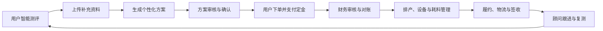

# LAVIDA 双端功能架构梳理

> 梳理范围：LAVIDA 用户 App 与总部运营管理后台。  
> 架构主线：**测评 → 方案 → 下单 → 财务审核 → 生产 → 履约 → 复测**。

## 一、用户 App 功能架构

| 产品端 | 一级模块 | 二级功能 | 三级功能／关键页面或动作 | 业务说明 |
|---|---|---|---|---|
| 用户 App | 首页与内容 | 服务闭环引导 | 首页、智能测评入口、历史方案入口、订单入口 | 向用户说明个性化抗衰服务流程，并引导进入高频业务。 |
| 用户 App | 首页与内容 | 健康资讯 | 资讯列表、资讯详情 | 发布测评、下单、方案解读等健康服务内容。 |
| 用户 App | 首页与内容 | 服务说明 | 测评说明、下单说明、方案解读 | 降低用户对资料上传、定金支付和方案内容的理解门槛。 |
| 用户 App | 智能测评 | 测评引导 | 测评说明页、授权说明页 | 明确测评流程、信息使用授权及注意事项。 |
| 用户 App | 智能测评 | 问卷采集 | 题目作答、基础健康信息采集 | 采集生成个性化建议所需的基础输入。 |
| 用户 App | 智能测评 | 资料补充 | 体检报告／检测资料上传 | 为抗氧化、代谢、睡眠等方向的方案细化提供依据。 |
| 用户 App | 智能测评 | 提交与生成 | 提交成功、方案生成中 | 提交测评并向用户反馈生成进度。 |
| 用户 App | 方案中心 | 方案查看 | 方案结果、方案详情 | 展示个性化建议、原料配比、功效说明、服用周期及调整建议。 |
| 用户 App | 方案中心 | 方案资产 | 历史方案、历史方案详情 | 沉淀用户已生成方案，支持回溯与再次转化。 |
| 用户 App | 订单与支付 | 订单创建 | 确认订单、实名信息 | 基于方案形成订单，并补齐履约所需信息。 |
| 用户 App | 订单与支付 | 定金支付 | 定金支付、支付结果 | 支持定金支付及结果反馈；支付后进入后台财务审核链路。 |
| 用户 App | 订单与支付 | 订单追踪 | 订单列表、订单详情、物流查询 | 查看订单审核、生产、发货等履约状态。 |
| 用户 App | 订单与支付 | 跨境服务 | 跨境订单页面 | 承载跨境订单相关的展示或履约信息。 |
| 用户 App | 个人中心 | 个人资产 | 当前方案、当前订单、历史测评、历史方案、历史订单 | 聚合用户服务资产，支持查看既往测评、方案与订单。 |
| 用户 App | 个人中心 | 个人资料 | 个人信息 | 维护用户基础档案。 |
| 用户 App | 个人中心 | 消息通知 | 消息列表、消息详情 | 承接方案、订单、履约及服务提醒。 |
| 用户 App | 个人中心 | 设置与合规 | 设置、隐私政策、授权说明 | 提供账户设置与隐私合规信息。 |

## 二、管理后台功能架构

| 产品端 | 一级模块 | 二级功能 | 三级功能／关键页面或动作 | 业务说明 |
|---|---|---|---|---|
| 管理后台 | 首页 | 经营看板 | 新增测评、待确认方案、待财务审核订单、待排产任务、低库存 SKU | 面向总部运营汇总关键业务量与待办。 |
| 管理后台 | 首页 | 风险与待办 | 风险告警、角色待办、快捷入口 | 聚合 SKU 校验、库存、设备及跨角色协作事项。 |
| 管理后台 | 客户中心 | 客户档案 | 客户列表、客户详情、客户编辑 | 维护客户基础资料及服务全链路档案。 |
| 管理后台 | 客户中心 | 服务跟进 | 跟进与复测 | 支持顾问对客户进行周期性随访和复测管理。 |
| 管理后台 | 测评管理 | 测评业务 | 测评列表、测评详情、代录测评 | 查看用户测评；支持顾问代录问卷与附件。 |
| 管理后台 | 测评管理 | 测评配置 | 题库管理 | 配置、维护测评问卷题目。 |
| 管理后台 | 方案中心 | 方案管理 | 方案列表、方案详情 | 查看和管理根据测评生成的个性化方案。 |
| 管理后台 | 方案中心 | 方案审核 | 方案审核 | 对待确认方案进行审核或确认。 |
| 管理后台 | 方案中心 | 配方解析 | 详细配方、版本对比 | 查看方案配方明细并比较版本调整。 |
| 管理后台 | 订单中心 | 订单管理 | 订单列表、订单详情、创建订单 | 基于方案创建并管理主订单。 |
| 管理后台 | 订单中心 | 订单编排 | 主子单拆分、SKU 快照 | 支持按履约或生产需要拆单，并冻结下单时的 SKU 信息。 |
| 管理后台 | 订单中心 | 售后服务 | 售后处理 | 承接订单异常、补发等售后业务。 |
| 管理后台 | 财务审核 | 到账审核 | 审核列表、审核详情 | 对定金或订单款项进行财务审核。 |
| 管理后台 | 财务审核 | 对账补款 | 金额对账与补款 | 处理金额差异、补款等资金闭环问题。 |
| 管理后台 | 生产中心 | 生产任务 | 生产任务、任务详情 | 将订单转化为可执行的生产任务。 |
| 管理后台 | 生产中心 | 排产与设备 | 排产台、设备管理 | 安排生产节奏，并分配、维护生产设备。 |
| 管理后台 | 生产中心 | 原料耗用 | SKU 耗料记录 | 记录生产任务对原料或 SKU 的耗用。 |
| 管理后台 | 履约中心 | 履约跟踪 | 履约列表、履约详情 | 跟踪订单从生产完成至交付的过程。 |
| 管理后台 | 履约中心 | 子订单履约 | 子订单跟踪 | 面向拆分后的订单执行分段履约。 |
| 管理后台 | 履约中心 | 签收管理 | 签收记录 | 记录并查询最终交付签收信息。 |
| 管理后台 | SKU 主数据 | SKU 台账 | SKU 台账 | 维护商品／原料主数据台账。 |
| 管理后台 | SKU 主数据 | 基础规则 | 分类与规格、供应商管理 | 管理 SKU 分类、规格及供应商信息。 |
| 管理后台 | SKU 主数据 | 配方规则 | 配方映射 | 建立方案配方与 SKU 的映射关系。 |
| 管理后台 | 库存采购 | 库存监控 | 库存总览、库存变动 | 查看库存现状及出入库变动。 |
| 管理后台 | 库存采购 | 风险与采购 | 预警中心、采购建议 | 识别低库存与断货风险，形成采购建议。 |
| 管理后台 | 加盟商经营 | 加盟商档案 | 加盟商列表、加盟商详情 | 管理加盟商基础信息与经营主体。 |
| 管理后台 | 加盟商经营 | 门店运营 | 门店看板、本店库存 | 查看加盟商门店经营情况与库存。 |
| 管理后台 | 加盟商经营 | 订货管理 | 订货单管理 | 管理加盟商订货业务。 |
| 管理后台 | 运营分析 | 订单分析 | 订单趋势 | 分析订单规模与变化趋势。 |
| 管理后台 | 运营分析 | 供应链分析 | SKU 消耗、生产效率 | 分析原料消耗与生产运营效率。 |
| 管理后台 | 运营分析 | 门店分析 | 门店经营 | 分析门店经营表现。 |
| 管理后台 | 消息中心 | 消息运营 | 消息中心、消息详情 | 统一承接系统通知、业务提醒及消息查看。 |
| 管理后台 | 集成开放 | 设备集成 | 设备接口 | 对接生产或检测设备接口。 |
| 管理后台 | 集成开放 | 模型集成 | 模型与回写 | 对接智能模型，并将结果回写至业务流程。 |
| 管理后台 | 系统设置 | 组织与人员 | 部门管理、人员管理、账号管理 | 维护组织、人员和账户。 |
| 管理后台 | 系统设置 | 权限管理 | 菜单管理、角色管理 | 配置菜单权限与角色授权。 |
| 管理后台 | 系统设置 | 基础与租户配置 | 字典管理、字典数据、租户管理、系统配置 | 管理基础数据、多租户及平台参数。 |
| 管理后台 | 系统设置 | 审计追踪 | 操作日志 | 记录管理端关键操作，支撑审计与问题定位。 |

## 三、关键业务闭环

## 四、核验说明

- 管理后台已按总部运营角色进入，核验一级菜单、各模块页面路由及首页待办／风险看板。
- 用户 App 已进入高阶服务用户账户，核验首页、测评入口、方案资产、订单追踪、个人资产、消息与设置入口。
- 本次仅进行页面访问与功能结构核验，未执行真实支付、订单创建、审批提交或其他会产生业务数据的操作。
